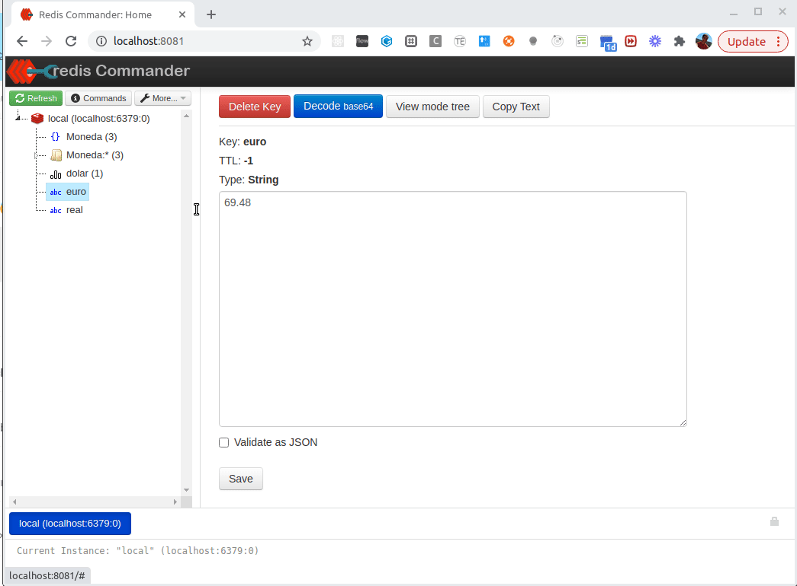

# Ejemplo Monedas con Springboot y Redis

[](https://travis-ci.com/uqbar-project/eg-monedas-springboot-redis)

## Levantar Redis

Una vez que [instalaste Redis](https://redis.io/download) y lo descargaste en una carpeta, hacés el build local y levantás el server y el cliente en dos terminales diferentes:

```bash
make
./src/redis-server
./src/redis-client  # en otra terminal
```

## Carga de datos iniciales

Para ejecutar el script que carga los datos iniciales, tenés que ejecutar el script que está en Node (asumimos que ya lo tenés instalado):

```bash
cd datosInicialesNode
node cargaDatosInicial.js 
```

Eso te permitirá cargar valores para monedas como euro, dólar y peso y visualizarlas en algún cliente Redis como Redis Commander.



## Endpoints en springboot

### Objetos de dominio

Nuestro modelo en Springboot no va a trabajar con los datos iniciales que generamos en Node, sino que va a tener una estructura más **opaca**, determinada por las annotations de nuestro objeto de dominio Moneda:

```xtend
@RedisHash("Moneda")
@Accessors
class Moneda {
	@JsonIgnore
	BigDecimal cotizacionMoneda
	
	@Id
	String descripcion
```

- `@RedisHash` es la clave que va a agrupar todos los objetos Moneda en una lista de valores en Redis
- `@Id` es el índice interno por el cual vamos a poder recuperar una moneda (ya que la única consulta que tiene sentido es buscar por identificador, si queremos buscar las monedas cuya cotización es mayor a 5 no es Redis la tecnología más apropiada)

### Repositorio

La interfaz que propone Spring boot con Redis es idéntica a la del modelo relacional (aun cuando su implementación es bastante diferente):

```xtend
interface MonedasRepository extends CrudRepository<Moneda, String> {}
```

Como la interfaz ya propone `findAll` y `findById` que es lo que queremos hacer, no tenemos que definir mensajes adicionales.

### Controller

Vamos a definir tres endpoints:

- uno que permita conocer todas las monedas
- otro que convierta de pesos a una moneda en cuestión
- y otro que convierta de la moneda en cuestión a pesos

El primer endpoint se implementa con un método GET, los otros dos si bien no tienen efecto colateral, necesitamos pasar cierta información y nos parece mejor hacerla por el body antes que tener que encadenar en la URL todos los valores por query params.

La implementación de la búsqueda de todas las monedas es trivial:

```xtend
	@GetMapping("/monedas")
	@ApiOperation("Recupera información de los valores de cada moneda.")
	def getMonedas() {
		this.monedasRepository.findAll
	}
```

Y tampoco es muy complejo el endpoint de conversión, solo que

- extraemos en un método interno la búsqueda de la moneda, y tirar un error con código http 404 si la moneda no es encontrada
- delegamos al objeto de dominio la responsabilidad de la conversión (no olvidarse de dejar que cada objeto cumpla su responsabilidad)

```xtend
	@PutMapping("/monedaAPesos/")
	@ApiOperation("Convierte un valor de una moneda determinada a pesos. Para conocer la lista de monedas disponibles tenés el endpoint /GET. Se distinguen mayúsculas de minúsculas. Ejemplo: si 1 zloty está 24 pesos, al convertir 10 zlotys obtendremos 240 pesos.")
	def getMonedasAPesos(@RequestBody Conversion conversion) {
		conversion.moneda.convertirAPesos(conversion.valorAConvertir)
	}
```

Recordemos que `conversion.moneda` es un shortcut del extension method `getMoneda` que toma como parámetro un objeto conversión:

```xtend
	protected def Moneda getMoneda(Conversion conversion) {
		this.monedasRepository.findById(conversion.monedaAConvertir).orElseThrow [ new ResponseStatusException(HttpStatus.NOT_FOUND, "La moneda a convertir no existe") ]
	}
```

La conversión es un objeto que sirve para capturar los parámetros necesarios para convertir de una moneda a pesos o viceversa.

### Testeo de integración

Podés ver cómo se testean en forma completa los endpoints que convierten de peos a una moneda y viceversa.


